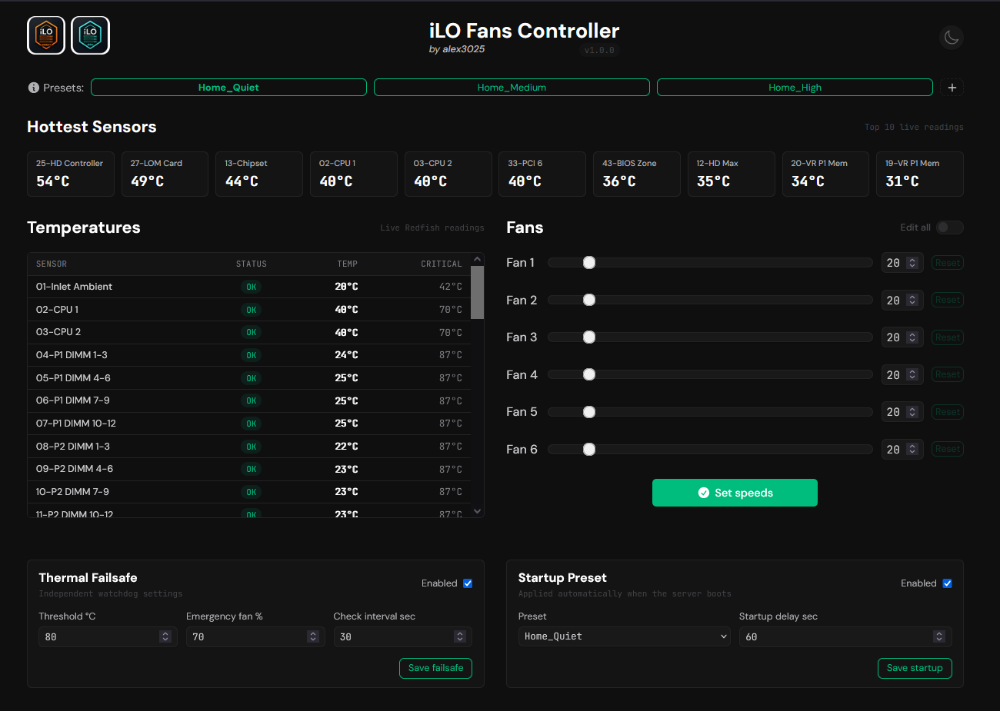

<h1 align="center">iLO Fans Controller Extended</h1>

<p align="center">
  Maintained by <a href="https://github.com/MJ-meo-dmt"><strong>MJ-meo-dmt</strong></a>
</p>

> 🍴 This is a fork of [alex3025/ilo-fans-controller](https://github.com/alex3025/ilo-fans-controller) with significant enhancements for automatic fan control, temperature monitoring, startup presets, and thermal failsafe automation.
>
> The original project provides the lightweight PHP-based iLO fan controller foundation. This fork expands on it with live Redfish temperature readings, a compact dashboard, top hottest sensor summary, fan auto-refresh, optional iLO direct/tunnel links, CLI support, and optional systemd services.

<p align="center">
  
  <br>
  <i>Extended dashboard with temperatures, fan controls, failsafe settings, and startup preset support.</i>
</p>

---

## Index

- [Features in this fork](#features-in-this-fork)
- [1. Configure iLO access](#1-configure-ilo-access)
- [2. Install files](#2-install-files)
- [3. File permissions](#3-file-permissions)
- [4. `presets.json` structure](#4-presetsjson-structure)
- [5. API endpoints](#5-api-endpoints)
  - [Fans](#fans)
  - [Presets](#presets)
  - [Temperatures](#temperatures)
  - [Failsafe settings](#failsafe-settings)
  - [Failsafe check](#failsafe-check)
  - [Startup settings](#startup-settings)
- [6. CLI commands](#6-cli-commands)
  - [`failsafe-settings`](#failsafe-settings-1)
  - [`failsafe-check`](#failsafe-check-1)
  - [`startup-settings`](#startup-settings-1)
  - [`apply-startup-preset`](#apply-startup-preset)
- [7. Thermal failsafe service](#7-thermal-failsafe-service)
  - [Create watchdog script](#create-watchdog-script)
  - [Create systemd service](#create-systemd-service)
- [8. Startup preset service](#8-startup-preset-service)
  - [Create log file](#create-log-file)
  - [Create systemd service](#create-systemd-service-1)
- [9. Testing the services](#9-testing-the-services)
  - [Test failsafe settings](#test-failsafe-settings)
  - [Test failsafe check](#test-failsafe-check)
  - [Test startup preset](#test-startup-preset)
- [10. Optional UFW example](#10-optional-ufw-example)
- [11. Security notes](#11-security-notes)
- [12. Notes on iLO tunnel link](#12-notes-on-ilo-tunnel-link)

## Features in this fork

- Live iLO temperature readings from Redfish
- Compact temperature table
- Top 10 hottest sensor summary
- Fan speed auto-refresh
- Slider edit protection so refresh does not overwrite changes while editing
- Optional direct iLO link and SSH tunnel iLO link
- Structured `presets.json` file
- Thermal failsafe settings
- Thermal failsafe recovery margin setting
- Automatic restore of the last applied preset after failsafe clears
- Startup preset settings
- CLI commands for automation
- Optional `systemd` services:
  - Thermal failsafe watchdog
  - Startup preset apply-on-boot

---

## 1. Configure iLO access

Open the `config.inc.php` file in your favourite text editor and change the variables according to your configuration.

> ℹ **NOTE:** `$ILO_HOST` is the IP address of your iLO interface, not the server itself.

> ℹ **NOTE:** It is recommended to create a dedicated iLO user with the minimum privileges required to access SSH and the Redfish/REST API.

Example:

```php
/*
ILO ACCESS CREDENTIALS
--------------
These are used to connect to the iLO
interface and manage the fan speeds.
*/

$ILO_HOST = '192.168.1.69';
$ILO_USERNAME = 'Administrator';
$ILO_PASSWORD = 'AdministratorPassword1234';

/*
OPTIONAL DASHBOARD iLO LINKS
--------------
Direct link opens https://$ILO_HOST.
Tunnel link is useful if iLO is reachable only through SSH local port forwarding.
*/

$ILO_DIRECT_URL = "https://$ILO_HOST";
$ILO_TUNNEL_URL = "https://localhost:8443/";
$SHOW_ILO_TUNNEL_LINK = true;
```

## 2. Install files

Create a new subdirectory in your web server root directory, usually `/var/www/html/`, and copy the required files:

```sh
sudo mkdir -p /var/www/html/ilo-fans-controller
sudo cp config.inc.php ilo-fan-controller-extended.php example_presets.json ilo_page_link_direct.png ilo_page_link_ssh.png /var/www/html/ilo-fans-controller/
```

Rename the extended PHP file to `index.php`:

Rename the example presets.json file to `presets.json`:

```sh
sudo mv /var/www/html/ilo-fans-controller/ilo-fan-controller-extended.php /var/www/html/ilo-fans-controller/index.php

sudo mv /var/www/html/ilo-fans-controller/example_presets.json /var/www/html/ilo-fans-controller/presets.json
```

Now open:

```text
http://<your-server-ip>/ilo-fans-controller/
```

or directly:

```text
http://<your-server-ip>/ilo-fans-controller/index.php
```

---

## 3. File permissions

The web server user needs to read `config.inc.php` and write `presets.json`.

Recommended permissions:

```sh
cd /var/www/html/ilo-fans-controller

sudo chown root:www-data config.inc.php
sudo chmod 640 config.inc.php

sudo chown root:root index.php ilo_page_link_direct.png ilo_page_link_ssh.png 
sudo chmod 644 index.php ilo_page_link_direct.png ilo_page_link_ssh.png 

sudo chown www-data:www-data presets.json
sudo chmod 660 presets.json
```

Expected result:

```text
-rw-r----- root     www-data   config.inc.php
-rw-r--r-- root     root       ilo_page_link_direct.png
-rw-r--r-- root     root       ilo_page_link_ssh.png
-rw-r--r-- root     root       index.php
-rw-rw---- www-data www-data   presets.json
```

---

## 4. `presets.json` structure

This extended version stores presets, failsafe settings, and startup settings in `presets.json`.

Example:

```json
{
  "presets": [
    {
      "name": "Home_Quiet",
      "speeds": [20]
    },
    {
      "name": "Home_Medium",
      "speeds": [40]
    },
    {
      "name": "Home_High",
      "speeds": [65]
    }
  ],
  "failsafe": {
    "enabled": true,
    "threshold_c": 80,
    "recovery_margin_c": 10,
    "fan_speed": 70,
    "interval_seconds": 30
  },
  "startup": {
    "enabled": true,
    "preset_name": "Home_Quiet",
    "delay_seconds": 60
  },
  "runtime": {
    "last_preset_name": "Home_Quiet",
    "failsafe_active": false
  }
}
```

The `recovery_margin_c` value controls when failsafe mode clears. *`very basic`*

Example: `80°C - 10°C = 70°C [at 70°C reset to previous preset]`

```json
"threshold_c": 80
"recovery_margin_c": 10
```

Single-speed presets like:

```json
"speeds": [20]
```

apply the same speed to all fans.

Multi-speed presets are also supported:

```json
"speeds": [20, 20, 20, 20, 20, 20]
```

---

## 5. API endpoints

The dashboard exposes several simple API endpoints.

### Fans

```text
GET ?api=fans
```

Example:

```sh
curl http://<server-ip>/ilo-fans-controller/index.php?api=fans
```

Returns current fan readings.

---

### Presets

```text
GET ?api=presets
```

Example:

```sh
curl http://<server-ip>/ilo-fans-controller/index.php?api=presets
```

Returns saved fan presets.

---

### Temperatures

```text
GET ?api=temperatures
```

Example:

```sh
curl http://<server-ip>/ilo-fans-controller/index.php?api=temperatures
```

Returns current iLO temperature sensors from Redfish.

---

### Failsafe settings

```text
GET ?api=failsafe-settings
```

Example:

```sh
curl http://<server-ip>/ilo-fans-controller/index.php?api=failsafe-settings
```

Returns:

```json
{
  "enabled": true,
  "threshold_c": 80,
  "recovery_margin_c": 10,
  "fan_speed": 70,
  "interval_seconds": 15
}
```

---

### Failsafe check

```text
GET ?api=failsafe-check
```

Example:

```sh
curl http://<server-ip>/ilo-fans-controller/index.php?api=failsafe-check
```

This checks temperatures immediately. If a valid sensor is at or above the configured threshold, all fans are forced to the configured failsafe fan speed. Once temperatures fall below the recovery threshold, the last applied preset is restored automatically.

---

### Startup settings

```text
GET ?api=startup-settings
```

Example:

```sh
curl http://<server-ip>/ilo-fans-controller/index.php?api=startup-settings
```

Returns:

```json
{
  "enabled": true,
  "preset_name": "Home_Quiet",
  "delay_seconds": 60
}
```

---

## 6. CLI commands

This version also supports CLI commands, useful for automation and `systemd` services.

Run from the server:

```sh
php /var/www/html/ilo-fans-controller/index.php failsafe-settings
```

```sh
php /var/www/html/ilo-fans-controller/index.php failsafe-check
```

```sh
php /var/www/html/ilo-fans-controller/index.php startup-settings
```

```sh
php /var/www/html/ilo-fans-controller/index.php apply-startup-preset
```

### `failsafe-settings`

Shows current saved failsafe settings.

```sh
php /var/www/html/ilo-fans-controller/index.php failsafe-settings
```

### `failsafe-check`

Checks current temperatures and triggers failsafe fan speed if needed.

```sh
php /var/www/html/ilo-fans-controller/index.php failsafe-check
```

Normal result:

```json
{
  "triggered": false,
  "enabled": true,
  "settings": {
    "enabled": true,
    "threshold_c": 80,
    "recovery_margin_c": 10,
    "fan_speed": 70,
    "interval_seconds": 15
  },
  "hot_sensors": [],
  "message": "Temperatures OK"
}
```

Triggered result:

```json
{
  "triggered": true,
  "enabled": true,
  "settings": {
    "enabled": true,
    "threshold_c": 80,
    "recovery_margin_c": 10,
    "fan_speed": 70,
    "interval_seconds": 15
  },
  "fan_update_ok": true,
  "hot_sensors": {
    "25-HD Controller": {
      "value": 82,
      "status": "OK",
      "upper_critical": 100
    }
  },
  "message": "Thermal failsafe triggered. Fans forced to emergency speed."
}
```

### `startup-settings`

Shows current startup preset settings.

```sh
php /var/www/html/ilo-fans-controller/index.php startup-settings
```

### `apply-startup-preset`

Applies the configured startup preset after the configured delay.

```sh
php /var/www/html/ilo-fans-controller/index.php apply-startup-preset
```

Example result:

```json
{
  "ok": true,
  "preset": "Home_Quiet",
  "mode": "single-speed",
  "speed": 20,
  "message": "Startup preset 'Home_Quiet' applied.",
  "settings": {
    "enabled": true,
    "preset_name": "Home_Quiet",
    "delay_seconds": 60
  }
}
```

---

## 7. Thermal failsafe service

The failsafe service runs independently of the browser.

It repeatedly runs:

```sh
php /var/www/html/ilo-fans-controller/index.php failsafe-check
```

using the interval configured in `presets.json`.

### Create watchdog script

Create:

```sh
sudo nano /usr/local/bin/ilo-failsafe-watchdog.sh
```

Add:

```sh
#!/bin/bash

APP="/var/www/html/ilo-fans-controller/index.php"
LOG="/var/log/ilo-failsafe.log"

while true; do
    SETTINGS_JSON="$(/usr/bin/php "$APP" failsafe-settings 2>/dev/null)"
    INTERVAL="$(echo "$SETTINGS_JSON" | /usr/bin/php -r '$j=json_decode(stream_get_contents(STDIN), true); echo intval($j["interval_seconds"] ?? 10);')"

    if [ -z "$INTERVAL" ] || [ "$INTERVAL" -lt 5 ]; then
        INTERVAL=10
    fi

    if [ "$INTERVAL" -gt 60 ]; then
        INTERVAL=60
    fi

    /usr/bin/php "$APP" failsafe-check >> "$LOG" 2>&1

    sleep "$INTERVAL"
done
```

Make it executable:

```sh
sudo chmod +x /usr/local/bin/ilo-failsafe-watchdog.sh
```

Create the log file:

```sh
sudo touch /var/log/ilo-failsafe.log
sudo chown www-data:www-data /var/log/ilo-failsafe.log
sudo chmod 664 /var/log/ilo-failsafe.log
```

### Create systemd service

Create:

```sh
sudo nano /etc/systemd/system/ilo-failsafe-watchdog.service
```

Add:

```ini
[Unit]
Description=iLO Fan Thermal Failsafe Watchdog
After=network-online.target apache2.service
Wants=network-online.target

[Service]
Type=simple
ExecStart=/usr/local/bin/ilo-failsafe-watchdog.sh
Restart=always
RestartSec=5
User=www-data
Group=www-data

[Install]
WantedBy=multi-user.target
```

Enable and start:

```sh
sudo systemctl daemon-reload
sudo systemctl enable --now ilo-failsafe-watchdog.service
```

Check status:

```sh
sudo systemctl status ilo-failsafe-watchdog.service
```

View logs:

```sh
sudo tail -f /var/log/ilo-failsafe.log
```

---

## 8. Startup preset service

The startup preset service applies the configured startup preset automatically after boot.

This is useful for home/lab servers that boot loudly before a quiet fan preset is manually applied.

### Create log file

```sh
sudo touch /var/log/ilo-startup-preset.log
sudo chown www-data:www-data /var/log/ilo-startup-preset.log
sudo chmod 664 /var/log/ilo-startup-preset.log
```

### Create systemd service

Create:

```sh
sudo nano /etc/systemd/system/ilo-startup-preset.service
```

Add:

```ini
[Unit]
Description=Apply iLO Fan Startup Preset
After=network-online.target apache2.service
Wants=network-online.target

[Service]
Type=oneshot
ExecStart=/usr/bin/php /var/www/html/ilo-fans-controller/index.php apply-startup-preset
User=www-data
Group=www-data
StandardOutput=append:/var/log/ilo-startup-preset.log
StandardError=append:/var/log/ilo-startup-preset.log

[Install]
WantedBy=multi-user.target
```

Enable it:

```sh
sudo systemctl daemon-reload
sudo systemctl enable ilo-startup-preset.service
```

Test manually:

```sh
sudo systemctl start ilo-startup-preset.service
sudo systemctl status ilo-startup-preset.service
sudo tail -n 50 /var/log/ilo-startup-preset.log
```

> ℹ **NOTE:** The service may remain in `activating` state while waiting for the configured `delay_seconds`.

Example successful log:

```json
{
  "ok": true,
  "preset": "Home_Quiet",
  "mode": "single-speed",
  "speed": 20,
  "message": "Startup preset 'Home_Quiet' applied.",
  "settings": {
    "enabled": true,
    "preset_name": "Home_Quiet",
    "delay_seconds": 60
  }
}
```

---

## 9. Testing the services

### Test failsafe settings

```sh
php /var/www/html/ilo-fans-controller/index.php failsafe-settings
```

### Test failsafe check

```sh
php /var/www/html/ilo-fans-controller/index.php failsafe-check
```

To test that failsafe actually triggers, temporarily lower the threshold in the dashboard to a value below one of your current sensor readings, save it, then run:

```sh
php /var/www/html/ilo-fans-controller/index.php failsafe-check
```

After the test, restore the threshold to a safe value.

### Test startup preset

```sh
php /var/www/html/ilo-fans-controller/index.php apply-startup-preset
```

Or via systemd:

```sh
sudo systemctl start ilo-startup-preset.service
sudo tail -n 50 /var/log/ilo-startup-preset.log
```

---

## 10. Optional UFW example

If the dashboard should only be accessible from the local LAN:

```sh
sudo ufw default deny incoming
sudo ufw default allow outgoing

sudo ufw allow from 192.168.8.0/24 to any port 22 proto tcp comment 'SSH from LAN'
sudo ufw allow from 192.168.8.0/24 to any port 80 proto tcp comment 'Apache from LAN'

sudo ufw enable
sudo ufw status verbose
```

---

## 11. Security notes

> ⚠ **Important:** This dashboard can control server fans. Do not expose it directly to the public internet.

Recommended:

* Restrict access with firewall rules
* Use LAN-only access where possible
* Add HTTP Basic Auth if accessible by other users
* Keep `config.inc.php` readable only by `root` and `www-data`
* Keep `presets.json` writable only by `www-data`
* Use a dedicated iLO user with limited required permissions

Example permissions:

```sh
cd /var/www/html/ilo-fans-controller

sudo chown root:www-data config.inc.php
sudo chmod 640 config.inc.php

sudo chown www-data:www-data presets.json
sudo chmod 660 presets.json
```

---

## 12. Notes on iLO tunnel link

If your iLO interface is connected directly to a second NIC or is not reachable from your workstation, use SSH local port forwarding.

Example:

```sh
ssh -L 8443:10.10.10.2:443 user@server-ip
```

Then open:

```text
https://localhost:8443/
```

The dashboard can show both:

* Direct iLO link
* SSH tunnel iLO link

Configure this in `config.inc.php`:

```php
$ILO_DIRECT_URL = "https://$ILO_HOST";
$ILO_TUNNEL_URL = "https://localhost:8443/";
$SHOW_ILO_TUNNEL_LINK = true;
```

Set:

```php
$SHOW_ILO_TUNNEL_LINK = false;
```

to hide the SSH tunnel icon.
